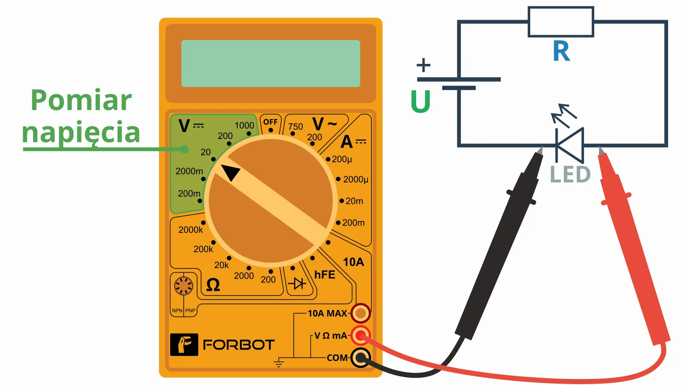

# Kurs-elektroniki

## Napięcie
https://youtu.be/zWL6LskZmZc

Napięcie zawsze jest mierzone między dwoma punktami. Tak jak mierzy się np. wysokość gór względem poziomu morza. Trzeba mieć dwa punkty i je porównać.

Napięcie może być **stałe** lub **zmienne**. W naszym przypadku będziemy zajmować się tylko napięciem stałym, bo to głównie z niego korzysta się podczas majsterkowania, zabaw z Arduino oraz Raspberry Pi. **Wszystkie baterie i akumulatory są właśnie źródłem napięcia stałego**.

Napięcie **zienne** znajduje się w gniazdku elektrycznym.

**Symbolem napięcia jest litera "U"**.

**Jednostką napięcia jest wolt**, który oznaczamy literą **V**. Napięcie może charakteryzować baterię. Ta, której używamy w kursie, powinna mieć 9 V, co czytamy jako „9 woltów”. W naszych eksperymentach będziemy pracować z bezpiecznymi dla zdrowia napięciami mieszczącymi się w zakresie od 0 do 9 V.

### Jak mierzyć napięcie
> Pomiaru powinniśmy dokonywać zawsze na najmniejszym możliwym zakresie – zapewnia to najlepszą precyzję pomiaru. Czyli przykładowo baterię 9 V mierzymy na zakresie 20 V, ale zasilacz, który miałby dawać 21 V, mierzylibyśmy już na zakresie 200 V.

Pomiaru napięcia dokonujemy zawsze równolegle! Czyli aby np. zmierzyć spadek napięcia na diodzie świecącej, należałoby miernik wpiąć tak, jak to jest widoczne poniżej.

Chcemy zmierzyć tylko napięcie baterii, więc podłączamy miernik równolegle do niej. Pamiętaj, aby sondy pomiarowe (tak nazywają się te kolorowe kable z ostrymi końcówkami) wpiąć w odpowiednie gniazda:

* **czarny** przewód do gniazda **COM** ,
* **czerwony** przewód do gniazda, które w opisie ma V.

Następnie dwie końcówki pomiarowe przyłóż do baterii. Czerwoną do (+) plusa , a czarną do (-) minusa. Nie ma różnicy, czy wyprowadzeń baterii dotkniesz od dołu, od góry czy od boku – **uważaj tylko, aby nie zrobić zwarcia, czyli aby NIE zewrzeć ze sobą dwóch biegunów baterii!**

## Prąd
https://youtu.be/sr7sHBbqGh0

## Opór (rezystancja)
https://youtu.be/0WQuf_Jnsdc

